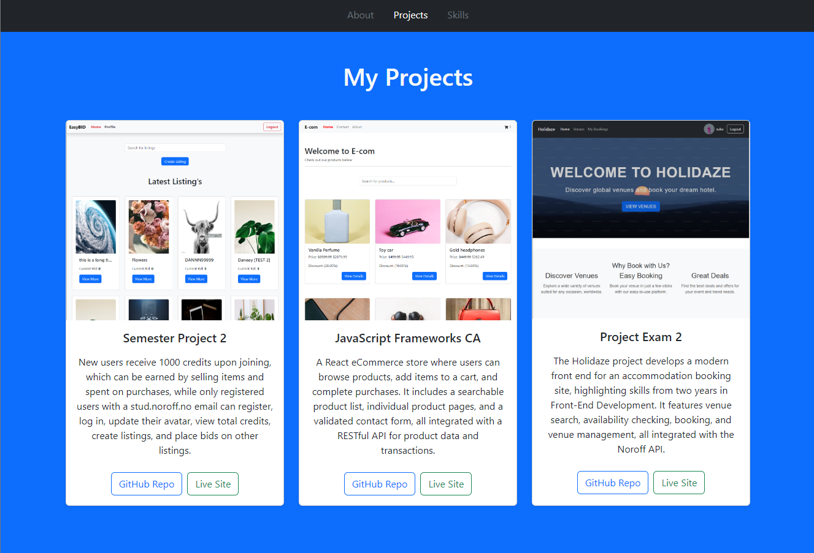

# Title

- Hi 👋, I'm Yoel Samson
- Welcome to my GitHub profile!




# Subtitle

Frontend Developer Student | Showcasing my work from the first year as I embark on my final year.

# Description

Hello! I’m a Frontend Developer student at Noroff Online School. In this portfolio, I’m excited to showcase the projects I completed during my first year of study. These projects highlight my growth and the skills I've developed as I prepare for my final year. They reflect my dedication and creativity in exploring the fascinating world of web development.

# Portfolio

1. Clone the repo:

```bash
git clone https://github.com/YoelSam1/yoel-portfolio2.git

```

2. Live demo Link:

```bash
https://unique-cactus-816e3b.netlify.app/#projects
```

# My project's

## Semester Project 2 an An auction site 
  - Build Using Javascript, Bootstrap, SASS

1. Github Link:

```bash
git clone https://github.com/YoelSam1/Semester-Project-2

```

2. Live demo Link:

```bash
https://semester-project-2-yoel.netlify.app/
```

## JavaScript Frameworks CA an eCommerce site 
  - Build Using React, Bootstrap

1. Github Link:

```bash
git clone https://github.com/YoelSam1/Front-end-React-E-com

```

2. Live demo Link:

```bash
https://react-ca-yoel.netlify.app/
```

## Project Exam 2 an An booking site 
  - Build Using React, Bootstrap

1. Github Link:

```bash
git clone https://github.com/YoelSam1/Yoel-projectexam2

```

2. Live demo Link:

```bash
https://funny-sprinkles-8fcd40.netlify.app/
```


# Skills

Programming Languages

- HTML
- CSS
- jAVASCRIPT
- React
- boostrap

Software

- Figma ( to Create a prototype in all sreen size)

Other

- Github
- Netlify (to deploy the site on live demo)

# Contact

- Email ( Yoelsamsom21@gmail.com)